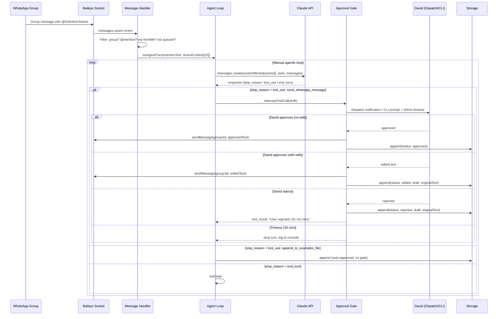

# feat: Build Solicited-Advice WhatsApp Bot MVP

## Overview

Build the first working version of Solicited-Advice: a Claude agent that lives in a WhatsApp group, drafts AI advice in David's voice when @mentioned, routes every draft through a human approval gate, and compounds its quality over time by recording approved exchanges. The MVP proves one hypothesis — do friends find the bot's advice valuable enough to engage with? — before any infrastructure scaling or content-pipeline work.

## Problem Frame

David's "AI Curious" WhatsApp group of non-technical-but-smart friends in their early 50s asks AI questions in conversation. David has a distinctive advice style (reframe first, identify workflow context, give a specific first step, stay jargon-free) that is hard to scale to every question in real time. A bot that approximates that style — with David as the approval gate — lets him multiply his reach while maintaining quality control until the bot earns autonomy.

The full problem frame and rationale for rejecting alternative approaches are in the origin document: `docs/brainstorms/2026-04-17-mvp-bot-brainstorm.md`.

## Requirements Trace

- R1. Bot receives WhatsApp group messages and triggers only on `@Solicited-Advice` @mentions
- R2. Bot drafts a reply in David's voice using a static system prompt + dynamic `approved-responses.md` examples
- R3. Every draft is routed through a human approval gate before sending; David can approve, edit, or reject
- R4. Approved exchanges (with edit status) are appended to `approved-responses.md` to compound the bot's quality over time
- R5. A graduation metric script computes edit rate over the last 20 decisions; David manually flips an autonomous-mode config once the threshold is met
- R6. The bot runs as a persistent process on David's Windows laptop with automatic crash recovery
- R7. The bot account is isolated on a throwaway WhatsApp account; David's personal account is never involved
- R8. No cloud costs in MVP; LLM via Claude Pro subscription (`@anthropic-ai/sdk`), bot on local laptop

## Scope Boundaries

- Content pipeline (Function 2 — repurposing conversations to LinkedIn/blog) is excluded from MVP
- Per-user persistent memory is excluded from MVP
- Retrieval over `approved-responses.md` (embedding/semantic search) is excluded; flat-file injection is sufficient for <50 entries
- Public deployment (other groups adopting the bot) is excluded; Pro subscription is personal-use only
- Managed Agents evaluation and VPS migration are excluded; re-evaluate after hypothesis is validated
- Autonomous mode is a config flag David flips manually — no automatic graduation, no self-promotion

### Deferred to Separate Tasks

- VPS migration (Oracle Free Tier / $5/mo): separate task once MVP is validated
- Windows Task Scheduler auto-start on reboot: separate task (PM2 crash recovery is sufficient for MVP)
- Opt-out per-user state: separate task if group members request it

## Context & Research

### Relevant Code and Patterns

- `pre-work/example1.md` — gold-standard advice exchange (Randy / beverage sales); shows the reframe-first, workflow-specific, jargon-free pattern the system prompt must encode
- `pre-work/example2.md` — gold-standard advice exchange (Derek / prompting + daily habit); shows the encourage-experimentation, challenge-yourself cadence
- These two examples seed `approved-responses.md` immediately after scaffold (see Unit 7)

### External References

- [WhiskeySockets/Baileys README](https://github.com/WhiskeySockets/Baileys) — v7 is ESM-only, Node 20+ required, breaking changes from v6
- [Baileys Wiki — Connecting](https://baileys.wiki/docs/socket/connecting/) — `useMultiFileAuthState`, `makeCacheableSignalKeyStore`, `fetchLatestBaileysVersion`
- [Baileys Wiki — Receiving Updates](https://baileys.wiki/docs/socket/receiving-updates/) — `messages.upsert`, LID mention detection, `sock.ev.process()` vs `.on()`
- [Baileys Wiki — Migrate to v7](https://baileys.wiki/docs/migration/to-v7.0.0/) — ESM migration, new auth-state keys
- [@anthropic-ai/sdk](https://www.npmjs.com/package/@anthropic-ai/sdk) — official Anthropic TS SDK; no separate "Agent SDK" product
- [Anthropic manual agentic loop docs](https://docs.anthropic.com/en/docs/agents-and-tools/tool-use) — approval gate requires manual loop, not tool runner
- [PM2 Restart Strategies](https://pm2.keymetrics.io/docs/usage/restart-strategies/) — Windows crash recovery with exponential backoff

### Institutional Learnings

None yet — first project. `docs/solutions/` does not exist.

## Key Technical Decisions

- **Manual agentic loop (not tool runner) for MVP**: The `@anthropic-ai/sdk` tool runner auto-executes all tools. The manual loop is required for the approval gate because it intercepts each `tool_use` block before execution. Switch to the tool runner when the bot graduates to autonomous mode — the graduation script is the trigger for that refactor. *(see origin: docs/brainstorms/2026-04-17-mvp-bot-brainstorm.md)*
- **`@anthropic-ai/sdk` is the implementation of "Claude Agent SDK"**: The brainstorm references a "Claude Agent SDK" — this is the official `@anthropic-ai/sdk` npm package. There is no separate product. The agentic pattern uses `client.messages.create()` in a `while (stop_reason !== 'end_turn')` loop with a tool-call intercept.
- **Prompt caching via two-block system prompt**: Core instructions (frozen) get one `cache_control: { type: "ephemeral" }` block; the loaded `approved-responses.md` content gets a second block with the same `cache_control`. System blocks are built once at startup and reused across all turns. Minimum 2048 tokens for caching on Sonnet 4.6. The `cache_control` object only accepts `{ type: "ephemeral" }` — there is no `ttl` field in the API. Never put volatile data (timestamps, message IDs) in the cached prefix.
- **Rolling message buffer per group**: Baileys v7 has no "get last N messages" API. The bot maintains a 30-message per-group in-memory buffer populated by `messages.upsert`, reset on process restart (acceptable — the bot only reasons about active conversations).
- **`approved-responses.md` format with metadata**: Each entry uses a structured heading (`## [ISO-date] · [first-name-alias] · [status]`) parseable by a simple grep/regex script. Status values: `approved` (no edit), `edited` (David changed the draft), `rejected` (no message sent). See Unit 7 for full schema.
- **Rejection tracking is required for the graduation metric**: The denominator is all decisions (approved + edited + rejected). Edit rate = `edited / (approved + edited)` in the last 20 non-rejected responses. Rejections are stored to keep the total-decisions count accurate.
- **Approval timeout = 30 minutes, silent drop**: If David does not respond to a Dispatch notification within 30 minutes, the pending approval is dropped and logged to console. No message is sent to the WhatsApp group. This prevents stale approvals from firing hours later.
- **Concurrent @mentions: queue depth 1**: If a second @mention arrives while an agent turn is in progress, it is queued. A third concurrent @mention triggers a polite holding message to the group and is dropped. This avoids context-mismatch issues where two independent drafts reason about the same conversation state.
- **`send_whatsapp_message` approval gate applies to clarifying questions too**: In supervised mode, any Claude-initiated message goes through the gate. This avoids unsupervised content in the group during the trust-building period.
- **Autonomous mode is a manual config flag**: The graduation script prints the metric; David edits `config/bot-config.json` to flip `autonomousMode: true`. The bot reads this at startup. There is no auto-flip.
- **Dispatched edit-flow is verified in Unit 2 before any other build; readline CLI is the likely default**: Claude Desktop Dispatch surfaces tools via MCP servers in its own session — it does not intercept tool calls made by an external `@anthropic-ai/sdk` process. This is the highest-uncertainty dependency. The Unit 2 spike verifies the Dispatch path, but implementers should assume Branch B (readline CLI) is the real implementation. Branch A code should not be built until the spike confirms Dispatch integration is viable. The readline fallback is the 2–4 hour build referenced in the brainstorm. *(see origin: open question #1)*
- **ESM-only project**: Baileys v7 requires ESM. `package.json` gets `"type": "module"`. All imports use ES module syntax. tsconfig targets `"module": "ESNext"` and `"moduleResolution": "Bundler"`.
- **PM2 for Windows crash recovery**: Runs `dist/index.js` with `--exp-backoff-restart-delay=100` (100ms → ~15s exponential). PM2 keeps the process alive across crashes without manual restart. `pm2 startup` generates a Windows startup script for reboot recovery.
- **Auth directory is gitignored**: `baileys_auth_info/` holds the WhatsApp session credentials for the throwaway account. Already covered by `.gitignore`; double-check before first commit.

## Open Questions

### Resolved During Planning

- **`approved-responses.md` format**: Structured markdown with parseable heading (`## [date] · [alias] · [status]`), `**Q:**` and `**Sent:**` fields. See Unit 7. Rejection entries include a `**Draft:**` field so David can review what was rejected later.
- **Graduation metric implementation**: Simple regex over the last 20 non-rejected entries in `approved-responses.md`. One TypeScript script in `scripts/graduation-check.ts` prints the result. No dashboard.
- **Concurrent @mention handling**: Queue with max depth 1. A polite "I'm working on another reply — please re-mention me in a moment" message is sent automatically (bypassing the approval gate, since it's a holding message, not advice).
- **Autonomous mode mechanics**: Manual config flip. `config/bot-config.json` has `autonomousMode: false`. The graduation script tells David when the threshold is met; he decides when to flip.
- **Windows SIGTERM**: `process.on('SIGTERM')` does not fire on Windows from Task Scheduler shutdown. Use `process.on('SIGINT')` for graceful cleanup. PM2's `stop` command sends SIGINT on Windows.

### Deferred to Implementation

- **Dispatch edit-flow capability**: Must be verified in Unit 2 (Dispatch spike) before the rest of the approval gate is built. If Dispatch does not support draft editing, the readline CLI fallback replaces it in Unit 6.
- **LID JID format for @mentions**: WhatsApp v7 migrated to LID identifiers for mentions in some group messages. The mention detection logic should compare on the number portion before `@` rather than full JID equality. May need adjustment if real-world testing shows mismatches.
- **Exact system prompt text**: The voice principles (from `pre-work/example1.md` and `example2.md`) and scope enforcement rules are written as part of Unit 8 (not here — this is a content decision, not an architecture decision).
- **`getMessage` implementation**: Baileys v7 requires a `getMessage` callback for message retry. Implementation should return the message from the rolling buffer if available; return `undefined` otherwise. Exact shape depends on buffer implementation from Unit 4.
- **First-use onboarding message to group**: The bot sends a plain-language "here's what I am, David is in the loop, here's how to opt out" message when first added to the group. Content and exact timing are deferred to the final smoke test phase.

## Output Structure

```
solicited-advice/
  src/
    bot/
      connection.ts        # Baileys socket setup and reconnection logic
      message-handler.ts   # @mention filter, concurrent queue, Baileys event listener
      message-buffer.ts    # rolling 30-message buffer per group JID
    agent/
      index.ts             # manual agentic loop (messages.create while loop)
      tools.ts             # send_whatsapp_message + append_to_examples_file definitions
      approval.ts          # approval gate: Dispatch integration or readline CLI fallback
      system-prompt.ts     # builds cached two-block system prompt from core + examples
    storage/
      examples.ts          # read/append approved-responses.md; on-startup load
      graduation.ts        # edit-rate calculation logic
    types.ts               # shared TypeScript interfaces (ApprovalDecision, BotTurn, etc.)
    index.ts               # process entry point: wires connection + agent, starts bot
  config/
    system-prompt-core.md  # David's voice principles, persona, scope rules (committed)
    bot-config.json        # { autonomousMode: false, approvalTimeoutMs: 1800000 }
  data/
    approved-responses.md  # gitignored; runtime memory file
    approved-responses-seed.md  # committed seed from pre-work examples (anonymized)
  scripts/
    graduation-check.ts    # prints edit rate over last 20 decisions; one-shot script
    dispatch-spike.ts      # Phase 2 only: standalone Dispatch verification script
  docs/
    brainstorms/           # existing
    plans/                 # this file
  pre-work/                # existing (example1.md, example2.md)
  pm2.config.js            # PM2 process definition
  package.json
  tsconfig.json
  .env.example             # ANTHROPIC_API_KEY, BOT_PHONE_NUMBER
  baileys_auth_info/       # gitignored; WhatsApp session credentials
```

## High-Level Technical Design

> *This illustrates the intended approach and is directional guidance for review, not implementation specification. The implementing agent should treat it as context, not code to reproduce.*



The system prompt is built once at startup as two `TextBlockParam` blocks with `cache_control: ephemeral`. The first block contains David's frozen core instructions (never changes mid-session). The second contains the loaded content of `approved-responses.md` (changes only when David runs a reload or restarts the process). Both blocks are reused for every `messages.create` call, maximizing cache hits.

## Implementation Units

---

- [ ] **Unit 1: Project Scaffolding**

**Goal:** Establish the Node/TypeScript/ESM project with all dependencies installed and a clean build pipeline. No runnable bot yet — just a working `npm run build` and `npm run dev`.

**Requirements:** R8

**Dependencies:** None

**Files:**
- Create: `package.json`
- Create: `tsconfig.json`
- Create: `.env.example`
- Create: `pm2.config.js`
- Create: `src/types.ts`
- Modify: `.gitignore` (replace Python-template cruft with Node/TS-appropriate rules; preserve the two custom lines for `approved-responses.md` and `.claude/settings.local.json`; add `baileys_auth_info/`, `data/approved-responses.md`, `dist/`, `.env`)
- Create: `config/bot-config.json`

**Approach:**
- `package.json`: `"type": "module"` (required by Baileys v7). Scripts: `build` (tsc), `dev` (tsx watch src/index.ts), `start` (node dist/index.js). Dependencies: `@whiskeysockets/baileys`, `@anthropic-ai/sdk`, `@hapi/boom`, `@cacheable/node-cache`, `pino`, `zod`. Dev: `typescript`, `tsx`, `@types/node`.
- Node 20+ is required (Baileys v7 hard constraint). Note this in `.env.example` and README.
- `tsconfig.json`: `"module": "ESNext"`, `"moduleResolution": "Bundler"`, `"target": "ES2022"`, `"outDir": "dist"`, `"strict": true`.
- `bot-config.json`: `{ "autonomousMode": false, "approvalTimeoutMs": 1800000, "maxContextMessages": 15, "queueDepthMax": 1 }`. This file is committed; it is not secret.
- `.env.example`: `ANTHROPIC_API_KEY=`, `BOT_PHONE_NUMBER=` (the throwaway SIM number, for context/logging only).
- `pm2.config.js`: `name: "solicited-advice"`, `script: "dist/index.js"`, `exp_backoff_restart_delay: 100`, `max_restarts: 10`.
- `src/types.ts`: Define shared interfaces: `AgentTurn`, `ApprovalDecision` (approved | edited | rejected | timeout), `PendingApproval`, `ApprovedEntry`.

**Patterns to follow:** No prior patterns in repo. Follow Baileys v7 ESM example.ts as the reference.

**Test scenarios:**
- Test expectation: none — this is scaffolding with no behavioral logic to test.

**Verification:**
- `npm run build` succeeds with no TypeScript errors
- `npm run dev` starts without errors (no bot logic yet, just process startup)
- `.gitignore` correctly ignores `baileys_auth_info/`, `data/approved-responses.md`, `.env`, `dist/`

---

- [ ] **Unit 2: Claude Desktop Dispatch Verification Spike**

**Goal:** Verify whether Claude Desktop Dispatch supports editing a draft message before approving it. This is the highest-uncertainty dependency — the entire approval UX architecture depends on the answer. This unit produces a decision, not production code.

**Requirements:** R3 (approval UX)

**Dependencies:** Unit 1

**Files:**
- Create: `scripts/dispatch-spike.ts` (temporary; delete or archive after decision)

**Approach:**
- Write a minimal standalone script that:
  1. Calls `client.messages.create()` with a single mock tool (`send_test_message`) that represents the approval-gate intercept
  2. Triggers a Dispatch notification
  3. Observes whether David can edit the draft text from the Dispatch UI before approving
- This does NOT connect to Baileys or WhatsApp. It is a pure API/Dispatch test.
- **Decision gate**: After running the spike, record the result in `docs/brainstorms/2026-04-17-mvp-bot-brainstorm.md` under "Dispatch edit-flow verification." The result determines which branch Unit 6 implements:
  - **Dispatch supports editing**: Unit 6 builds the full Dispatch integration in `approval.ts`
  - **Dispatch approve/reject only (no editing)**: Unit 6 builds the readline CLI fallback. Draft text is printed to the terminal; David types the approved/edited version. This is the 2–4 hour fallback the brainstorm mentions.

**Test scenarios:**
- Test expectation: none — this is a human-in-the-loop verification spike, not automated code.

**Verification:**
- The decision is documented. Unit 6 can proceed with a clear target.

---

- [ ] **Unit 3: Baileys Connection**

**Goal:** Establish and maintain a stable WhatsApp WebSocket connection on the throwaway account. Handle QR pairing on first run; reconnect automatically on transient disconnects; do not reconnect on permanent logout or session replacement.

**Requirements:** R1, R7

**Dependencies:** Unit 1

**Files:**
- Create: `src/bot/connection.ts`
- Test: `src/bot/connection.test.ts`

**Approach:**
- Use `useMultiFileAuthState('baileys_auth_info')` for session persistence. On second startup with valid credentials, no QR scan is needed.
- Use `makeCacheableSignalKeyStore` to wrap the key store — required for performance (avoids per-message file I/O for Signal key operations).
- Call `fetchLatestBaileysVersion()` on every startup. Never hardcode a WA Web version.
- Keep `msgRetryCounterCache` (NodeCache) outside the `startSock` function so retry counts survive reconnects.
- Implement `getMessage` callback: look up message from the rolling buffer (Unit 4); return `undefined` if not found. Required in Baileys v7 for message retries.
- `connection.update` handler must distinguish disconnect reasons:
  - `loggedOut` (401): do not reconnect; log and `process.exit(1)`. Credentials revoked — requires manual QR re-scan.
  - `connectionReplaced` (440): do not reconnect; log and exit. User opened WhatsApp Web elsewhere.
  - `badSession` (500): delete `baileys_auth_info/` directory, then reconnect.
  - All others (408, 428, 503, 515): reconnect via recursive `startSock()` call.
- `markOnlineOnConnect: false` — keeps WhatsApp app push notifications alive on David's phone.
- `cachedGroupMetadata`: wire up a NodeCache that is updated on `groups.update` and `group-participants.update` events. Required for group message sends (ban risk if skipped).
- `shouldSyncHistoryMessage: () => false` and `syncFullHistory: false` — skip the initial history dump; the rolling buffer handles context.
- `printQRInTerminal` is deprecated in v7. Generate QR with the `qrcode` npm package and render to terminal.
- Add `baileys_auth_info/` to Windows Defender exclusions (note in README) to avoid EBUSY errors on credential writes.
- Export: `startConnection(onMessage)` where `onMessage` is a callback invoked for each `messages.upsert` event.

**Patterns to follow:** Baileys `example.ts` canonical reference on GitHub.

**Test scenarios:**
- Happy path: `startConnection` calls the `onMessage` callback with a mocked `messages.upsert` payload
- Edge case: disconnect with `loggedOut` reason does not call `startSock` again (verified by spy)
- Edge case: disconnect with `restartRequired` (515) does call `startSock` again
- Edge case: `msgRetryCounterCache` is passed by reference and retains state after a simulated reconnect

**Verification:**
- Running `npm run dev` produces a QR code in the terminal on first run
- Scanning QR with throwaway SIM account pairs successfully
- Second `npm run dev` connects without QR (credentials persisted)
- Intentionally killing and restarting the process reconnects automatically

---

- [ ] **Unit 4: Message Listener and Context Buffer**

**Goal:** Filter incoming WhatsApp messages to `@Solicited-Advice` @mentions only; maintain a per-group rolling buffer of the last 30 messages for context; handle concurrent @mentions safely.

**Requirements:** R1, R2 (context window)

**Dependencies:** Unit 3

**Files:**
- Create: `src/bot/message-buffer.ts`
- Create: `src/bot/message-handler.ts`
- Test: `src/bot/message-buffer.test.ts`
- Test: `src/bot/message-handler.test.ts`

**Approach:**

`message-buffer.ts`:
- `MessageBuffer` class: `Map<string, WAMessage[]>` keyed by group JID.
- `push(msg)`: add to group's array; trim to 30 if over limit.
- `getRecent(groupJid, n)`: return last `n` messages from buffer.
- `getMessage(key)`: look up a specific message by `{ remoteJid, id }` for the Baileys `getMessage` callback.
- The buffer is in-memory only; loss on restart is acceptable.

`message-handler.ts`:
- Use `sock.ev.process()` (not `.on()`) for batch-safe event handling.
- For each message in `messages.upsert` where `type === 'notify'`:
  1. Skip `msg.key.fromMe === true`.
  2. Skip messages with a `messageTimestamp` older than 5 minutes — Baileys replays unread messages on reconnect, and re-triggering a stale @mention would generate a duplicate approval request. This guard must run before any agent dispatch.
  3. Call `buffer.push(msg)` unconditionally (all messages, not just @mentions, go into the buffer for context).
  4. Check if the message is a group message: `isJidGroup(msg.key.remoteJid)`.
  5. Check if the bot is @mentioned: compare on the number portion before `@` in `contextInfo.mentionedJid[]` (LID-safe check, not full JID equality).
  6. If both group and @mention checks pass, dispatch to the agent turn queue.
- **Concurrent @mention queue**: a simple per-group boolean `isProcessing`. If `isProcessing` is false, start an agent turn. If true and queue is empty, enqueue. If true and queue is non-empty (second concurrent mention), send a polite holding message (`"I'm working on another reply — please re-mention me in a moment"`) directly via `sock.sendMessage` (no approval gate — this is a system message, not advice) and drop the third mention. The holding message bypasses the approval gate because it contains no advice content.
- Extract message text: check `msg.message.conversation`, `msg.message.extendedTextMessage?.text`, `msg.message.imageMessage?.caption` in that order.
- Context assembly: `buffer.getRecent(groupJid, config.maxContextMessages)` filtered to text-bearing messages only (skip media-only entries that have no caption or useful text content).

**Patterns to follow:** Baileys receiving-updates docs; `sock.ev.process()` batch handler pattern.

**Test scenarios:**
- Happy path: a text message with the bot's JID in `mentionedJid[]` triggers the agent queue
- Happy path: a non-@mention message is buffered but does not trigger the agent queue
- Edge case: `msg.key.fromMe === true` is silently skipped
- Edge case: non-group message (individual JID) is silently skipped
- Edge case: second concurrent @mention while `isProcessing` is true goes into the queue; third triggers the holding message
- Edge case: @mention with no text content (image-only with no caption) is handled without throwing
- Edge case: mention JID is in LID format — comparison on number portion still detects the match
- Edge case: buffer respects the 30-message cap (31st message evicts the oldest)
- Edge case: message with `messageTimestamp` older than 5 minutes is silently skipped even if it contains an @mention (stale-replay guard)

**Verification:**
- In a test WhatsApp group, sending a plain message does not trigger a bot response
- Sending `@Solicited-Advice test` triggers an agent turn (verified via console log before agent is wired)
- A second rapid @mention while the first is processing produces the holding message in the group

---

- [ ] **Unit 5: Claude Agent (Manual Loop + System Prompt)**

**Goal:** Wire the manual agentic loop using `@anthropic-ai/sdk`. Build the two-block cached system prompt (frozen core + loaded examples). Define the tool surface. The approval intercept is a hook placeholder in this unit — Unit 6 fills it in.

**Requirements:** R2, R3 (loop shape)

**Dependencies:** Unit 1

**Files:**
- Create: `src/agent/index.ts`
- Create: `src/agent/tools.ts`
- Create: `src/agent/system-prompt.ts`
- Create: `config/system-prompt-core.md`
- Test: `src/agent/system-prompt.test.ts`
- Test: `src/agent/tools.test.ts`

**Approach:**

`system-prompt.ts`:
- `buildSystemBlocks(examplesContent: string): TextBlockParam[]`
- Block 1: reads `config/system-prompt-core.md` (frozen). `cache_control: { type: "ephemeral" }`.
- Block 2: `examplesContent` (the loaded `approved-responses.md`). `cache_control: { type: "ephemeral" }`. Note: the Anthropic `cache_control` API only accepts `{ type: "ephemeral" }` — there is no `ttl` field. Cache lifetime is fixed by Anthropic (~5 minutes). Both blocks use the same shape.
- Called once at startup. The returned array is reused for every `messages.create` call.
- Do not re-read `approved-responses.md` on each message turn — that would invalidate the cache on every file change.
- Log `cache_creation_input_tokens` and `cache_read_input_tokens` from `response.usage` to confirm caching is working on the first few turns.

`tools.ts`:
- Two tool definitions as `Anthropic.Tool[]` (raw JSON Schema — compatible with the manual loop).
- `send_whatsapp_message`: `{ message_text: string, recipient_jid: string }`. Description must state that this tool sends a WhatsApp message and requires human approval before execution.
- `append_to_examples_file`: `{ question: string, response: string, person?: string, status: "approved" | "edited" | "rejected", original_draft?: string }`. Auto-approved (no gate).
- Export: `tools` array, `APPROVAL_REQUIRED_TOOLS: Set<string>` = `new Set(["send_whatsapp_message"])`.

`agent/index.ts`:
- `runAgentTurn(mentionText, recentContextMessages, systemBlocks, onToolCall): Promise<void>`
- `onToolCall` is an async hook: `(toolName, toolInput) => Promise<ToolResult>`. Unit 6 fills in the approval logic; Unit 5 just wires the callback interface.
- Manual loop: `while (true)` → `messages.create(...)` → if `stop_reason === "end_turn"` break → if `stop_reason !== "tool_use"` break → iterate `response.content` for `tool_use` blocks → call `onToolCall` → push `tool_result` blocks back as user turn → continue.
- `APPROVAL_REQUIRED_TOOLS` is checked inside the loop: if the tool name is in the set, forward to `onToolCall`; otherwise auto-execute.
- Error handling: if `messages.create` throws, log the error and return (do not crash the process). The Baileys event loop continues.
- Context format: recent messages are serialized to plain text (`"[Name]: message text"`) and appended after the @mention text in the user turn.

`config/system-prompt-core.md`:
- Written in this unit. Content encodes David's advice principles from `pre-work/example1.md` and `example2.md`:
  - Reframe the question before answering
  - Ask about the person's actual workflow/context, not generic use cases
  - Give concrete first steps ("here's what I would do in your situation")
  - Short, practical, jargon-free
  - Encourage experimentation; use AI to learn AI
  - Scope guard: respond only to good-faith AI-advice questions; defer medical/legal/financial with caveats; redirect personal/sensitive topics to David
  - In supervised mode, all responses (including clarifying questions) go through the approval gate
- The system prompt also instructs the bot: "You are David's AI stand-in in the 'AI Curious' WhatsApp group. David will review every message before it is sent."

**Patterns to follow:** Anthropic manual agentic loop docs; prompt caching with `TextBlockParam` array.

**Test scenarios:**
- Happy path: `buildSystemBlocks` returns an array of two blocks with `cache_control` set on both
- Happy path: the second block content matches the provided `examplesContent` string exactly
- Happy path: `runAgentTurn` calls `messages.create` at least once and calls `onToolCall` when the response contains a `tool_use` block
- Happy path: `runAgentTurn` exits cleanly when `stop_reason === "end_turn"` with no tool calls
- Edge case: `runAgentTurn` exits after `stop_reason === "end_turn"` even if `response.content` has mixed text and tool_use blocks
- Error path: `messages.create` throws an API error — `runAgentTurn` catches it, logs, and returns without re-throwing
- Integration: `APPROVAL_REQUIRED_TOOLS` contains `"send_whatsapp_message"` and does not contain `"append_to_examples_file"`

**Verification:**
- `npm run dev` with a stub `onToolCall` that always returns `"approved"` processes a mocked @mention and reaches `end_turn` without throwing
- `cache_read_input_tokens > 0` on the second API call to the same process (confirm caching is active)
- The system prompt in `config/system-prompt-core.md` passes a sanity read: could a reader identify David's voice from it?

---

- [ ] **Unit 6: Approval Gate**

**Goal:** Implement the `onToolCall` hook for `send_whatsapp_message`. This unit has two branches determined by the Unit 2 spike result. Both branches enforce the 30-minute timeout and log all decisions.

**Requirements:** R3, R4 (approval and storage trigger)

**Dependencies:** Unit 2 (spike decision), Unit 5

**Files:**
- Create: `src/agent/approval.ts`
- Test: `src/agent/approval.test.ts`

**Approach:**

`approval.ts` exports `createApprovalGate(sock, config): ApprovalGateFn` where `ApprovalGateFn = (toolName, toolInput) => Promise<ToolCallResult>`.

Common to both branches:
- Wrap the human-response await in a `Promise.race` against a `setTimeout` of `config.approvalTimeoutMs` (30 minutes).
- On timeout: log `[TIMEOUT] approval expired for turn at [timestamp]`, return `{ approved: false, reason: "timeout" }`. Do not send to WhatsApp.
- Log all decisions to console: `[APPROVED]`, `[EDITED]`, `[REJECTED]`, `[TIMEOUT]` with timestamp and a truncated draft preview (first 80 chars).

**Branch A — Dispatch integration** (if Unit 2 confirms edit support):
- Dispatch is already the approval UX when Claude Desktop intercepts the tool call. The `send_whatsapp_message` tool definition in `tools.ts` is what Dispatch surfaces to David. No additional code is needed in `approval.ts` for the basic approve/reject flow.
- For draft editing from Dispatch: capture the edited text from the tool result that Dispatch returns. If the returned `message_text` differs from the original input, mark the decision as `edited`.
- The approval gate in this branch is thin: detect diff between input and returned text, assign status, then call `sock.sendMessage`.

**Branch B — readline CLI fallback** (if Unit 2 shows Dispatch edit-flow is not supported):
- Print the draft to the terminal in a clearly formatted block.
- Prompt: `[a]pprove / [e]dit / [r]eject (30 min timeout) > `.
- If `a`: call `sock.sendMessage` with original text.
- If `e`: prompt for replacement text (`Enter new message text (blank line to finish):`), then call `sock.sendMessage` with edited text.
- If `r`: return tool result `"User rejected. Do not retry."`.
- Use `readline.createInterface` with `process.stdin` / `process.stdout`. Close the interface after each decision to avoid blocking the event loop. **Important:** Branch B is single-threaded for approvals — only one readline prompt is active at a time. The queue-depth-1 constraint in Unit 4 is load-bearing for this reason: the queued turn fires its approval gate only after the first resolves, preventing interleaved prompts on the same stdin.

After decision in both branches:
- Call `storage.appendEntry(decision)` (Unit 7) to record the outcome.
- Return the appropriate `ToolCallResult` string back to the agent loop.

**Patterns to follow:** Anthropic manual agentic loop approval pattern (from research).

**Test scenarios:**
- Happy path (Branch B): `a` input results in `sock.sendMessage` being called with the original draft text
- Happy path (Branch B): `e` input with new text results in `sock.sendMessage` called with edited text, status `edited`
- Happy path (Branch B): `r` input results in no `sock.sendMessage` call, returns rejection string
- Edge case: timeout (30 min) fires before any input — no `sock.sendMessage` call, returns timeout result
- Integration: after approval, `storage.appendEntry` is called with the correct status and text

**Verification:**
- Running a manual end-to-end test (Baileys connected, real @mention in test group) produces a terminal prompt (Branch B) or Dispatch notification (Branch A) before any WhatsApp message is sent
- Approving sends the message to the test group within 5 seconds
- Rejecting sends nothing; the group is silent

---

- [ ] **Unit 7: Storage Layer (approved-responses.md)**

**Goal:** Define and implement the `approved-responses.md` schema. Load the file at startup for system prompt injection. Append new entries after approval decisions. Seed the file from `pre-work/example1.md` and `example2.md`.

**Requirements:** R4, R5 (graduation metric input)

**Dependencies:** Unit 1

**Files:**
- Create: `src/storage/examples.ts`
- Create: `data/approved-responses-seed.md` (committed; anonymized examples derived from pre-work)
- Test: `src/storage/examples.test.ts`

**Approach:**

**File schema** — each entry uses a parseable heading and standard fields:

```
## 2026-04-17 · Randy · edited

**Q:** What resources can I use to help a friend get started with AI for beverage sales?

**Draft:** (omitted when status is "approved"; included when "edited" or "rejected")
I would share some podcasts...

**Sent:** I would start by looking at his workflow and identifying repetitive busy-work tasks...
```

- Heading format: `## [ISO-8601 date] · [first-name alias] · [status]`
- Status values: `approved`, `edited`, `rejected`
- `**Draft:**` field: included when `edited` (shows what was changed) or `rejected` (for David's review). Omitted when `approved` (draft = sent, no diff to show).
- `**Sent:**` field: omitted when `rejected` (nothing was sent).
- Entries are separated by a blank line. File grows append-only.

`examples.ts`:
- `loadExamples(): Promise<string>` — reads `data/approved-responses.md` if it exists; otherwise returns the content of `data/approved-responses-seed.md`. Returns the raw markdown string for injection into the system prompt.
- `appendEntry(entry: ApprovedEntry): Promise<void>` — appends a formatted entry to `data/approved-responses.md`. Creates the file if it does not exist. Uses `path.join` (not string concatenation) for Windows path safety. Wraps in try/catch; logs errors without throwing.
- On first run (no `approved-responses.md`): `loadExamples` returns the seed content; the first real approval creates `approved-responses.md` and appends to it.

`data/approved-responses-seed.md`:
- Two entries derived from `pre-work/example1.md` (Randy, beverage sales) and `pre-work/example2.md` (Derek, prompting habit). Anonymized or used as-is per David's discretion — these are the committed seed examples.
- Status: both are `approved` (they represent David's unaided advice, pre-bot).

**Test scenarios:**
- Happy path: `loadExamples` returns seed content when `approved-responses.md` does not exist
- Happy path: `loadExamples` returns runtime file content when `approved-responses.md` exists
- Happy path: `appendEntry` with status `approved` writes a heading + Q + Sent block (no Draft field)
- Happy path: `appendEntry` with status `edited` writes a heading + Q + Draft + Sent block
- Happy path: `appendEntry` with status `rejected` writes a heading + Q + Draft block (no Sent field)
- Edge case: `appendEntry` with a very long `response` string does not truncate
- Error path: `appendEntry` catches and logs a file write error without re-throwing (process stays alive)
- Integration: two `appendEntry` calls produce two parseable headings in the file

**Verification:**
- After the first test approval, `cat data/approved-responses.md` shows the entry with correct heading format
- `loadExamples` on a fresh clone (no runtime file) returns the seed content
- The graduation script (Unit 8) can parse the headings and count statuses correctly

---

- [ ] **Unit 8: Graduation Metric Script**

**Goal:** One-shot script that reads `approved-responses.md`, finds the last 20 decisions, and prints the edit rate. Tells David whether the bot has earned autonomous mode.

**Requirements:** R5

**Dependencies:** Unit 7

**Files:**
- Create: `src/storage/graduation.ts`
- Create: `scripts/graduation-check.ts`
- Test: `src/storage/graduation.test.ts`

**Approach:**

`graduation.ts`:
- `parseEntries(fileContent: string): ApprovedEntry[]` — parse all entries from the file by scanning for `##` headings matching the `## [date] · [alias] · [status]` pattern.
- `computeEditRate(entries: ApprovedEntry[], windowSize = 20): { editRate: number, total: number, edited: number, approved: number, rejected: number }` — take the last `windowSize` entries; compute edit rate as `edited / (approved + edited)`. Rejections are counted in `total` but excluded from the denominator (edit rate measures draft quality among sent responses).
- `GRADUATION_THRESHOLD = 0.20` (20%).

`graduation-check.ts`:
- Reads `data/approved-responses.md`.
- Calls `parseEntries` and `computeEditRate`.
- Prints a human-readable report:
  ```
  === Graduation Check ===
  Last 20 decisions: 18 sent (12 approved, 6 edited), 2 rejected
  Edit rate: 33% (6/18) — threshold: 20%
  Status: NOT READY for autonomous mode
  ```
  Or:
  ```
  Edit rate: 15% (3/20) — threshold: 20%
  Status: READY — consider flipping autonomousMode in config/bot-config.json
  ```
- Exits with code 0 in both cases (informational script, not a CI gate).

**Patterns to follow:** Simple Node.js script with `fs.readFileSync`; no framework needed.

**Test scenarios:**
- Happy path: 20 entries with 3 `edited` → edit rate = 15%, status READY
- Happy path: 20 entries with 5 `edited` → edit rate = 25%, status NOT READY
- Edge case: fewer than 20 entries total — compute over all available entries; print "(only N decisions recorded)" in the report
- Edge case: all entries are `rejected` — edited / (approved + edited) = 0/0; print "no sent responses yet" instead of NaN
- Edge case: `approved-responses.md` does not exist — print "no data yet" and exit cleanly
- Edge case: file exists but contains zero parseable headings — same as above

**Verification:**
- `npx tsx scripts/graduation-check.ts` runs and prints a readable report on a file with the seed entries
- The parsed entry count matches a manual count of `##` headings in the file
- The report correctly identifies READY vs NOT READY based on the threshold

---

- [ ] **Unit 9: Integration Wiring (Entry Point)**

**Goal:** Wire all units together in `src/index.ts`. The running bot: starts Baileys, loads examples, builds the system prompt, listens for @mentions, runs agent turns, applies the approval gate, appends to storage. A complete end-to-end turn should work before the Windows smoke test.

**Requirements:** All (R1–R8)

**Dependencies:** Units 3–8 complete

**Files:**
- Create: `src/index.ts`
- Modify: `src/agent/index.ts` (wire `onToolCall` to the real approval gate)

**Approach:**
- Load `config/bot-config.json`.
- Call `loadExamples()` (Unit 7) to get current examples content.
- Call `buildSystemBlocks(examplesContent)` (Unit 5) once; store the result.
- Call `startConnection(onMessage)` (Unit 3); pass message handler.
- `onMessage` callback calls the Unit 4 message handler, which calls `runAgentTurn` with the real `onToolCall` from Unit 6.
- Graceful shutdown: `process.on('SIGINT', ...)` — close the Baileys socket cleanly before exit. `process.on('SIGTERM', ...)` for completeness, but PM2 uses SIGINT on Windows.
- No SIGTERM dependency for graceful shutdown — Windows does not reliably deliver SIGTERM from Task Scheduler or PM2 stop.

**Test scenarios:**
- Integration: mocked Baileys socket delivers a mock @mention → agent runs → mock `onToolCall` is called with `"send_whatsapp_message"` tool → `storage.appendEntry` is called
- Integration: `SIGINT` triggers graceful shutdown without unhandled-promise-rejection warnings

**Verification:**
- Full end-to-end run in a test WhatsApp group (not "AI Curious"):
  1. `npm run dev` produces a QR code
  2. Scan with throwaway SIM account
  3. Send `@Solicited-Advice what's a good first AI use case for a sales professional?`
  4. Terminal (or Dispatch) shows approval prompt with a draft response
  5. Approve → message appears in WhatsApp group
  6. `data/approved-responses.md` shows the new entry
  7. `npx tsx scripts/graduation-check.ts` prints the entry count

---

- [ ] **Unit 10: Windows Smoke Test and PM2 Setup**

**Goal:** Validate the bot runs stably on the Windows laptop under realistic conditions. Configure PM2 for crash recovery. Document any Windows-specific setup steps.

**Requirements:** R6

**Dependencies:** Unit 9

**Files:**
- Modify: `pm2.config.js` (finalize with correct paths and env)
- Modify: `README.md` (add Windows setup and AV exclusion instructions)

**Approach:**

**PM2 setup:**
- `pm2 start pm2.config.js` — start the bot process.
- `pm2 save` — persist the process list.
- `pm2 startup` — generate a Windows startup script (requires admin in some configurations). If `pm2 startup` is insufficient, document the Task Scheduler fallback: create a task that runs `pm2 resurrect` on user login.
- Test crash recovery: `pm2 stop solicited-advice` then wait for PM2 to restart with exponential backoff.

**Windows-specific validation checklist (not automated):**
- [ ] AV exclusion: add `baileys_auth_info/` and `data/` to Windows Defender exclusions (prevents EBUSY on credential writes)
- [ ] Power plan: verify laptop is set to "High Performance" (prevents NIC sleep during idle)
- [ ] USB suspend disabled: Device Manager → USB Root Hub → Power Management → uncheck "allow computer to turn off this device"
- [ ] Long path support: check if Windows long-path limit causes issues with `baileys_auth_info/` file paths (enable via Group Policy if hit)
- [ ] SIGINT handling: `pm2 stop solicited-advice` cleanly closes the Baileys socket (no orphaned WA Web connection)

**Pre-"AI Curious" validation:**
- Run the bot in a personal test group for at least 24 hours before introducing it to the "AI Curious" group
- Verify: reconnects after Windows sleep/wake; no duplicate messages on reconnect; approval gate works across phone and desktop Dispatch/CLI
- Send the group onboarding message (see Deferred — content TBD) manually on first day

**Test scenarios:**
- Test expectation: none — this is a human-executed checklist, not automated tests.

**Verification:**
- `pm2 list` shows `solicited-advice` with status `online`
- Bot survives a simulated crash (kill the process, PM2 restarts it within 15 seconds)
- Bot survives a laptop sleep/wake cycle (Baileys reconnects within 60 seconds of wake)
- 24-hour test-group run with no unhandled errors in `pm2 logs solicited-advice`

---

## System-Wide Impact

- **Interaction graph:** The Baileys `messages.upsert` event is the single entry point. All agent turns are triggered from here. There is no background job, cron, or secondary event source in MVP.
- **Error propagation:** Errors inside `runAgentTurn` are caught at the agent loop boundary and logged to console. They do not propagate to the Baileys event handler, so the bot stays alive and continues processing future messages. Errors in `appendEntry` are caught and logged without re-throwing.
- **State lifecycle risks:** The rolling message buffer is lost on process restart. Baileys delivers unread messages on reconnect; these will be buffered but may trigger agent turns if they contain @mentions. Guard: only process messages with a timestamp within the last 5 minutes on reconnect (prevents re-drafting stale @mentions).
- **API surface parity:** No HTTP API surface in MVP. All interaction is via WhatsApp and the console/Dispatch approval UI.
- **Integration coverage:** The key cross-layer scenario that unit tests alone cannot prove is: a real WhatsApp @mention → Baileys event → agent turn → approval prompt → message send → file append. This is validated by Unit 9's end-to-end test in a real test group.
- **Unchanged invariants:** David's personal WhatsApp account is never touched. `approved-responses.md` is append-only during normal operation (no edits, no deletes). The `config/bot-config.json` autonomousMode flag starts as `false` and is only changed manually.

## Risks & Dependencies

| Risk | Mitigation |
|------|------------|
| Baileys v7 LID @mention detection fails silently | Detect by testing in real group; compare on number portion before `@` not full JID; log all incoming mentions for debugging |
| Claude Desktop Dispatch does not support draft editing | Unit 2 spike verifies this before any other build; CLI fallback is scoped and ready to implement in Unit 6 |
| WhatsApp bans the throwaway account during development | Use `fetchLatestBaileysVersion()` on every startup; `cachedGroupMetadata` to avoid metadata-API hammering; avoid sending too many messages in rapid succession during testing |
| Windows Defender EBUSY errors on auth file writes | Exclusion list documented in README and smoke-test checklist |
| Approval timeout fires while David is traveling / asleep | 30-min timeout is documented and expected; the group never sees a "bot is thinking" message so stale approvals are invisible |
| `approved-responses.md` grows unwieldy for system prompt injection (>50 entries) | Retrieval/embedding upgrade is in the brainstorm's "Future Phases." Flag at 40 entries and address in v1.1 |
| Claude Pro subscription is personal-use only | Public deployment requires a metered API key; MVP is private friend-group only; documented in brainstorm |
| Stale @mention replayed on reconnect triggers duplicate approval request | Guard: skip messages with a timestamp older than 5 minutes at the message-handler level |

## Documentation / Operational Notes

- `README.md` needs a setup section for the Windows laptop: Node 20+ install, PM2 global install, AV exclusion steps, QR pairing instructions, `.env` setup.
- `approved-responses.md` must be manually backed up periodically (it is gitignored). Consider a `scripts/backup-examples.ts` script that copies it to a date-stamped file — deferred post-MVP.
- The bot's first message to the "AI Curious" group should be a plain-language disclosure: what the bot is, that David reviews every message, and how to opt out (DM David). Content is not yet written — add to Unit 10 pre-launch checklist.

## Sources & References

- **Origin document:** [docs/brainstorms/2026-04-17-mvp-bot-brainstorm.md](docs/brainstorms/2026-04-17-mvp-bot-brainstorm.md)
- Gold-standard voice examples: [pre-work/example1.md](pre-work/example1.md), [pre-work/example2.md](pre-work/example2.md)
- Baileys v7 README: https://github.com/WhiskeySockets/Baileys
- Baileys Wiki: https://baileys.wiki/docs/intro/
- Baileys v7 migration guide: https://baileys.wiki/docs/migration/to-v7.0.0/
- Anthropic TypeScript SDK: https://www.npmjs.com/package/@anthropic-ai/sdk
- Anthropic manual agentic loop: https://docs.anthropic.com/en/docs/agents-and-tools/tool-use
- PM2 restart strategies: https://pm2.keymetrics.io/docs/usage/restart-strategies/
